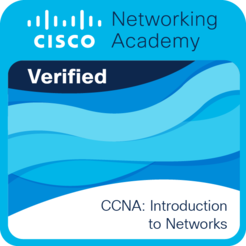

# Timothé Darmoise

Welcome on my profile page !  
Here you can find some of my completed projects.

## About me

I'm a 20-year-old french student, studying at [UTBM](https://utbm.fr/ " ").  
I'm currently learning :
- Networking
- Object-oriented programming
- Web programming

## Main UTBM's Projects :
- **[Munchkin](https://github.com/gabflrt/AP4B " ")**, Recreating the Munchkin role-playing game in Java with JavaFX.
- **[AP4A](https://github.com/TimDrms/AP4A-Project " ")**, Development of a simulator to model an IOT ecosystem specialized in workspace air quality monitoring in C++.
- **[Skyjo](https://github.com/TimDrms/Skyjo " ")**, Recreation of the Skyjo card game in Java.
- **[LO21](https://github.com/TimDrms/Projet-LO21 " ")**, Simplified version of genetic algorithms, one approach to solving optimization problems.
- **[Jeu de dames](https://github.com/TimDrms/Jeu-de-dames-SQL " ")**, Checkers game that works entirely in SQL.

## My Certifications :

## Contact

You can contact me using

- Mail `timothe.darmoise1@gmail.com`.
